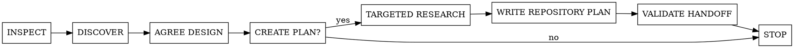

# foreman-plan

Discover first. Write a plan only after the user approves both the design and plan generation. Never implement it.

## Adaptive discovery

Inspect the project and use the smallest adequate mode.

### Direct

Use only when no material choice remains, the change is local to one established component or contract, and reversal is cheap. State inferred requirements, assumptions, boundaries, and verification briefly; confirm the design without manufacturing alternatives.

### Short design

Use when a limited material choice could change scope, architecture, behavior, or safety:

- Ask one focused question at a time only when its answer changes the design.
- Offer 2 to 3 viable approaches, real trade-offs, and a recommendation.
- Present a concise design covering boundaries, behavior, failure handling, and tests; obtain approval.

### Full design

Use when work crosses subsystems, changes shared or public contracts, requires migration or rollout, creates material security or operational risk, is costly to reverse, or is explicitly requested. Resolve components, interfaces, data flow, migration, errors, security, compatibility, and validation. Stay proportional and avoid file-by-file implementation instructions.

## Plan confirmation gate

After design approval, explicitly ask whether to create the repository implementation plan. Do not infer consent from skill invocation or design approval. If declined, stop with the approved design in chat.

If approved:

1. Inspect repository planning conventions, baseline commit, relevant components and contracts, exemplar paths and symbols, concrete mutation boundaries, dependencies, and available test, lint, typecheck, build, migration, security, and operational commands.
2. Use the repository's established plan location; otherwise write `docs/plans/YYYY-MM-DD-<topic>.md`.
3. Copy and complete [plan-template.md](plan-template.md). Remove instructional comments and placeholders.
4. Validate the written plan before reporting completion.

## Plan fidelity

The document is a generic repository artifact, not Foreman-specific. Do not add status, owner, model, harness, or agent-report sections.

Make each feature independently assignable when safe:

- Define outcome, scope, dependencies, acceptance criteria, representative test scenarios, and a component-and-contract implementation guide.
- Record the baseline commit or immutable ref the plan was researched against. Require implementation to stop when the working `HEAD` differs until the orchestrator validates or revises the plan.
- Use concrete path globs for mutation boundaries. Allowed globs are the exclusive write set; protected globs and symbols take precedence; every unlisted path requires escalation.
- Parallelize only along existing domain boundaries, never by inventing artificial path splits. Features are disjoint only when globs do not overlap and they share no generated artifact, manifest, migration, contract, database state, queue, flag, cache, environment configuration, CI surface, or other mutable side effect.
- Put shared contracts, migrations, dependencies, and utilities in an earlier serialized feature or wave. Later features depend on that owner instead of restating or duplicating the foundation.
- Give acceptance criteria and scenarios stable IDs with explicit coverage mapping. Include only scenarios that protect an acceptance criterion, plus concrete fixtures or inputs needed to reproduce them.
- Name existing exemplar paths or symbols and state which pattern to copy and what not to copy. Prefer existing components; add new layers only when an approved decision requires them.
- Include exact signatures, schema fragments, representative payloads, affected callers and versions, error behavior, and telemetry names when those contracts change.
- Require explicit concurrency and idempotency, security and privacy, observability, rollout and rollback, third-party dependency, documentation, and non-functional impact decisions. Default to `None` with a reason; add mechanisms only when decisions or acceptance criteria require them.
- State ordered intra-feature implementation steps when migration, compatibility, or delivery safety depends on sequence.
- Give each implementation agent gate prerequisites, exact quality commands, expected results, and required non-command evidence. If a required command cannot be discovered, record a blocking decision for the orchestrator; never silently omit it.
- Place an orchestrator verification checkpoint after every wave. Agent gate success permits checkpoint review only; the next wave starts only after the orchestrator independently reruns every listed feature and wave gate and verifies results and boundaries.
- Treat quality commands as minimum evidence, not the complete definition of done. Completion also requires every acceptance criterion and scenario to be satisfied. Worker claims never replace independent verification.
- Prefer existing patterns and the smallest sufficient design. Reject speculative abstractions, duplicated mechanisms, unrelated refactoring, and premature extensibility.

Keep guidance high-level enough to preserve engineering judgment. Do not prescribe line-by-line edits, exhaustive test matrices, or unsupported file changes.

## Validate the handoff

Before finishing, ensure:

- No unresolved placeholder, contradiction, or blocking decision remains.
- The baseline still matches implementation `HEAD`, or the plan was explicitly revalidated and revised.
- The dependency graph, execution waves, and every-wave checkpoints agree.
- Parallel features follow real domain boundaries, have exclusive non-overlapping path ownership, and share no hidden mutable resource.
- Acceptance criteria are observable, mapped to reproducible scenarios, and cover applicable happy, failure, edge, compatibility, and non-functional behavior without checklist padding.
- Relevant non-functional requirements have measurable budgets; non-applicable concerns have reasons.
- Implementation guidance names existing components, scoped exemplars, data flow, intra-feature sequence, migrations, and failure behavior without dictating code.
- Contract changes include enough exact shape, caller inventory, errors, and telemetry to prevent competing interpretations.
- Feature gates name prerequisites, exact repository commands, expected outcomes, and non-command evidence; unavailable required gates remain blocking.
- Concurrency, idempotency, security, privacy, observability, rollout, rollback, dependency, and documentation impacts are explicit.
- The plan contains everything an independent implementation agent needs without repeated orchestrator clarification.

Return the plan path and a one-sentence scope summary. Do not implement the plan.

## Rules

- Match repository patterns and preserve unrelated work.
- Ask nothing that cannot change the design or plan.
- Create no document before the explicit plan confirmation gate.
- Do not commit unless requested.
