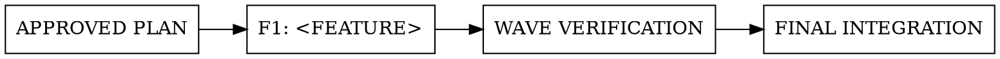

# <Plan title>

<!-- Remove all instructional comments and replace every placeholder. -->

## Goal

<Describe the user or system outcome and why it matters.>

## Baseline

- **Repository:** <repository identifier>
- **Commit:** `<immutable commit SHA or equivalent ref>`

Before implementation, compare the working `HEAD` with this commit. If they differ, stop until the orchestrator confirms the plan is still valid or revises the plan and baseline.

## Constraints

- <Behavior, compatibility, security, operational, or delivery constraint>

## Non-goals

- <Explicitly excluded behavior, adjacent work, or tempting out-of-scope refactor>

## Decisions

- <Approved product or technical decision and its rationale>

## Dependency graph

<!-- Show feature and integration dependencies. Omit the graph only for a single feature. -->



## Execution waves

<!-- Parallelize only when existing domain boundaries align with non-overlapping path globs and no shared artifacts or mutable resources. Never invent path splits for concurrency. Put shared foundations in an earlier serialized wave and make later features depend on their owning feature. -->

### Wave 1: <Wave objective>

- F1: <Feature name>
- F2: <Feature name, when safely parallel>

### Wave 1 integration gates

After every implementation agent has passed its own feature quality gates, the wave enters orchestrator verification. Agent success does not unlock the next wave. The orchestrator:

- inspects the combined diff and repository status
- verifies allowed, protected, and unlisted mutation boundaries
- independently reruns every feature quality command listed for this wave and inspects its result
- runs every shared integration check listed below:

```bash
# <exact repository command>
```

Expected result: <observable passing outcome>.

Do not start another wave until the orchestrator has passed every listed feature and wave gate.

<!-- Repeat the wave and its checkpoint for every later wave. -->

## Features

### F1: <Feature name>

#### Outcome

<Describe the independently valuable behavior delivered by this feature.>

#### Scope

- <Included behavior>
- <Feature-specific non-goal>

#### Dependencies

- <Prior feature, shared contract, migration, or `None` with reason>

#### Mutation boundaries

<!-- Use concrete path globs. Components belong in the implementation guide, not as ownership boundaries. Allowed is the exclusive write set. Protected entries take precedence even when nested inside an allowed glob. -->

**Allowed:**

- `<owned/path/**>`

**Protected:**

- `<protected/path/** or named immutable symbol or contract>`

**Shared mutable resources:**

- <Database state, queue, feature flag, cache, environment or CI configuration, generated artifact, or `None` with reason>

If implementation requires a protected or unlisted path, symbol, contract, or shared resource, stop and return control to the orchestrator.

#### Acceptance criteria

- **AC1:** <Concise, observable behavior>
- **AC2:** Given <state>, when <action>, then <result> where sequencing matters.

#### Test scenarios

<!-- Include only scenarios that protect an acceptance criterion. Delete categories that do not apply rather than inventing work. -->

- **T1 (covers AC1): Happy path:** <fixture or concrete input, state, and expected result>
- **T2 (covers AC2): Failure:** <fixture or failure condition and preserved behavior>
- **T3 (covers AC1, AC2): Edge:** <fixture or boundary condition and expected result>
- **T4 (covers AC#): Compatibility:** <existing caller, format, version, or behavior that remains valid>
- **T5 (covers AC#): Non-functional:** <measurable security, accessibility, performance, or reliability expectation>

#### Contract and caller changes

- **Contracts:** <Exact signature, schema fragment, representative request and response, migration shape, or `None` with reason>
- **Affected callers:** <Callers, formats, versions, and compatibility expectations, or `None` with reason>
- **Errors:** <Stable error types, codes, messages, and failure semantics, or `None` with reason>
- **Observability signals:** <Exact log, metric, trace, or alert names and dimensions, or `None` with reason>

#### Implementation guide

- **Components:** <Existing components and responsibilities; add a new component only when an approved decision requires it>
- **Contracts and data flow:** <Interfaces, boundaries, and flow>
- **State and failure handling:** <Persistence, migration, compatibility, rollback, and failure behavior>
- **Implementation sequence:** <Ordered steps only where migration, compatibility, or delivery safety requires them; otherwise `None`>
- **Exemplars:** `<one or two existing paths or symbols>`; follow <specific pattern> but do not copy <out-of-scope behavior>
- **Must not invent:** <Public symbols, schemas, error shapes, or behavior beyond approved contract changes>

Avoid line-by-line instructions and speculative abstractions.

#### Cross-cutting impacts

<!-- Default to `None` with a reason. Add mechanisms only when an approved decision or acceptance criterion requires them. -->

- **Concurrency and idempotency:** <Races, retries, ordering, locking, delivery semantics, or `None` with reason>
- **Security and privacy:** <Controls, threat or data impact, or `None` with reason>
- **Observability:** <Logs, metrics, traces, error reporting, or `None` with reason>
- **Rollout and rollback:** <Deployment sequencing, feature flag, recovery, or `None` with reason>
- **Third-party dependencies:** <Added, upgraded, removed dependency and compatibility impact, or `None` with reason>
- **Documentation:** <User, operator, API, migration, or changelog updates, or `None` with reason>
- **Non-functional budgets:** <Measurable performance, reliability, accessibility, or security threshold, or `None` with reason>

#### Feature quality gates

**Prerequisites:**

- <Required environment variables, services, fixtures, seed data, feature flags, or `None`>

The implementation agent must run:

```bash
# <exact focused test command>
# <exact lint, typecheck, build, or migration validation command>
```

Expected results:

- <Command-specific passing outcome>
- AC1 is covered by T1 and T3; AC2 is covered by T2 and T3.
- No protected or unlisted boundary, shared resource, or unrelated behavior changed.

**Additional required evidence:**

- <Manual, visual, operational, migration, or other non-command evidence for an AC; otherwise `None` with reason>

If a required command cannot be discovered, record it as a blocking decision for the orchestrator. Never silently omit a gate. Commands are minimum evidence, not the definition of done. The feature is complete only when every acceptance criterion and scenario is satisfied, all listed commands pass, and required non-command evidence is verified.

<!-- Repeat the feature section for F2, F3, and later features. -->

## Final integration gates

After all execution waves, the orchestrator:

- confirms the implementation baseline still matches or the plan was revalidated after drift
- inspects the complete diff for requirement fidelity, unintended coupling, duplication, and out-of-scope changes
- verifies every acceptance criterion against the integrated behavior
- independently runs every repository-wide check listed below:

```bash
git diff --check
# <exact repository lint command>
# <exact repository typecheck or build command>
# <exact integration or end-to-end test command>
```

Expected result: all commands pass without unrelated regressions, skipped required coverage, unresolved conflicts, or unexplained gate omissions.

## Risks and unresolved decisions

- **Risk:** <Concrete implementation or delivery risk and mitigation>
- **Decision:** <Non-blocking decision that may be deferred, or `None`>

Blocking decisions must be resolved before this plan is considered ready for implementation.
